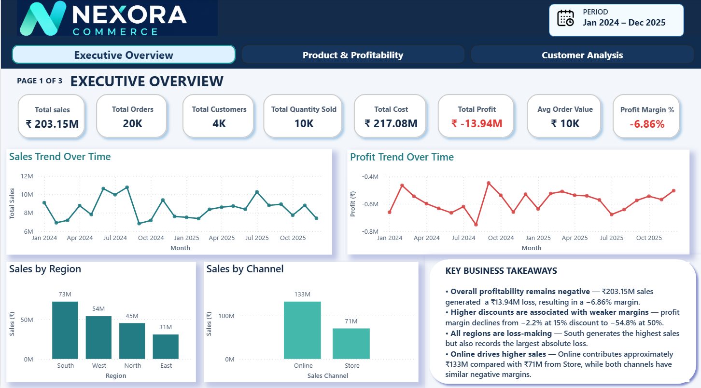
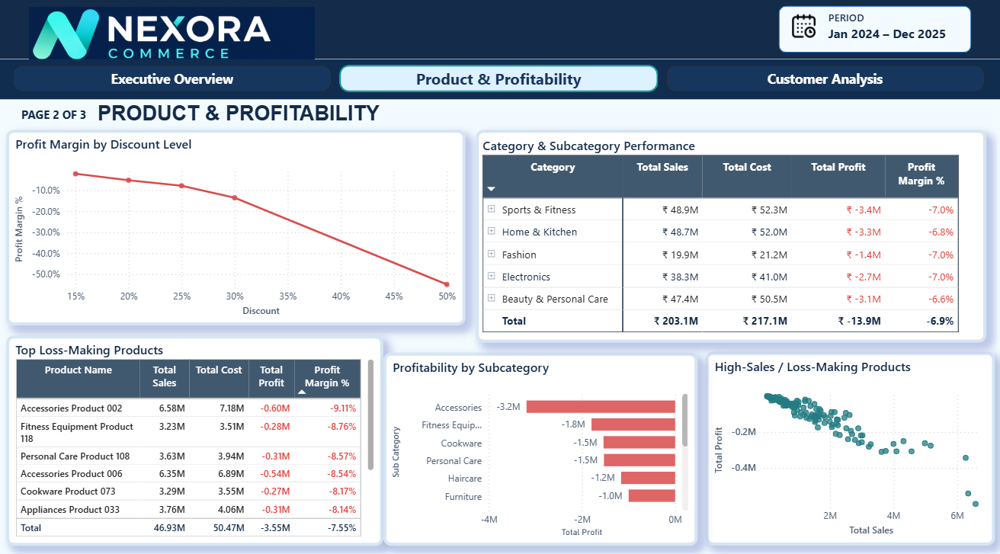
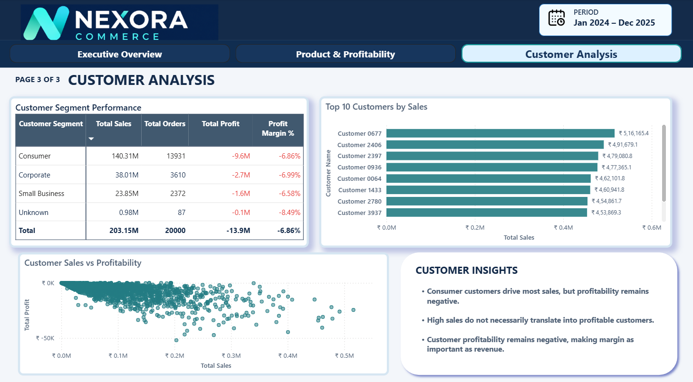
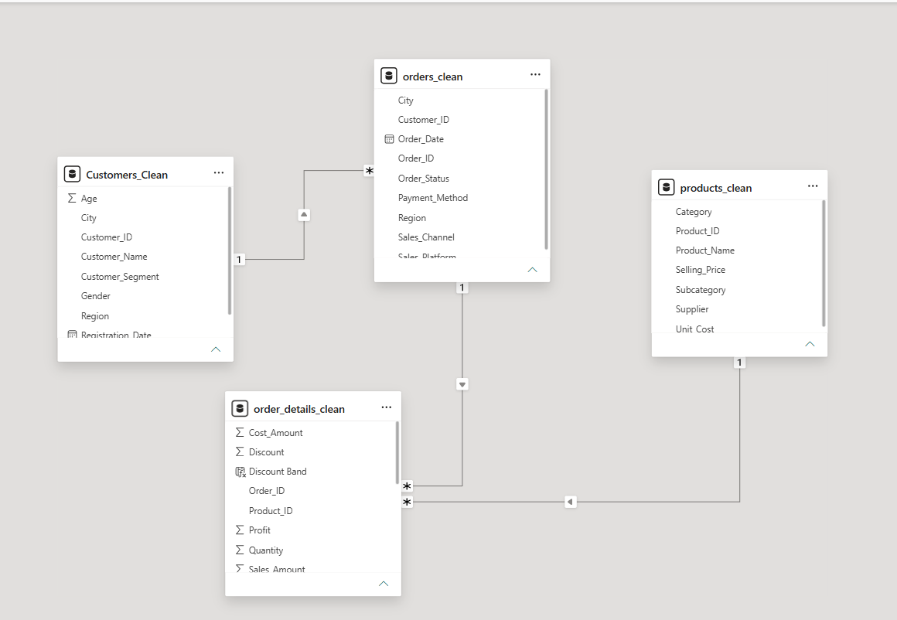

# Nexora Commerce — Retail Sales, Customer & Profitability Analytics

A business-focused retail analytics project built using **Microsoft Excel, Power Query, Power BI and DAX** to analyze sales performance, customer behavior and profitability.

> **Note:** This project uses a **synthetic dataset** created for portfolio and learning purposes. It is not real company data.

---

## 📊 Project Overview

**Nexora Commerce** is a fictional omnichannel retail business operating across multiple regions and cities in India through **online and physical store channels**.

The business generates substantial sales revenue, but profitability remains negative. This project analyzes the available sales, customer, product and transaction data to identify the major areas contributing to profitability problems and translate the findings into business-oriented recommendations.

**Role:** Junior Data Analyst
**Industry:** Retail & E-commerce
**Analysis Period:** January 2024 – December 2025

---

## 🎯 Business Problem

Nexora Commerce generates significant sales revenue, but the business is not converting that revenue into positive profit.

Management wants to understand:

* Which products and categories are contributing to losses?
* Are higher discounts associated with weaker profitability?
* Which regions generate the most sales and profit/loss?
* Which customer segments contribute the most revenue?
* How do online and store channels compare?
* Are high-sales products and customers actually profitable?
* What actions could help improve overall profitability?

---

## 🔎 Business Questions

### Sales Performance

* How are sales changing over time?
* Which categories and subcategories generate the most sales?
* Which regions contribute the most revenue?
* How do online and store channels compare?

### Profitability

* Which products and categories generate losses?
* Which high-sales products are loss-making?
* How does profitability vary across regions?
* What is the overall profit margin?

### Customers

* Which customer segments generate the most sales?
* Does higher customer revenue translate into higher profitability?
* Are high-sales customers profitable?

### Discounts

* How does profitability change across discount levels?
* Are higher discounts associated with weaker profit margins?

---

## 🗂️ Dataset Structure

The project uses four related tables:

### Customers

Contains customer-level information such as:

* Customer ID
* Customer Name
* Gender
* Age
* City
* State
* Region
* Customer Segment
* Registration Date

### Products

Contains product information such as:

* Product ID
* Product Name
* Category
* Subcategory
* Supplier
* Unit Cost
* Selling Price

### Orders

Contains order-level information such as:

* Order ID
* Order Date
* Customer ID
* Sales Channel
* Sales Platform
* City
* Region
* Payment Method
* Order Status

### Order Details

Contains transaction-level product information such as:

* Order ID
* Product ID
* Quantity
* Unit Price
* Discount
* Sales Amount
* Cost Amount
* Profit

---

## 🧹 Data Cleaning & Transformation

The raw data contained several quality issues that were identified and addressed using **Power Query**.

### Customers

* Handled missing Customer Segment values
* Handled missing City values
* Removed redundant State field
* Trimmed text fields
* Validated data types

### Products

* Handled missing Supplier values
* Standardized inconsistent Category capitalization
* Trimmed text fields
* Validated data types

### Orders

* Checked for duplicate Order IDs
* Checked for blank values
* Validated text fields
* Validated date and other data types

### Order Details

* Removed 8 zero-quantity transactions
* Removed exact duplicate records
* Retained negative-profit transactions because they are meaningful for profitability analysis
* Retained valid discount values, including 0% and 50%
* Rounded financial values to two decimal places
* Trimmed ID fields
* Validated data types

The cleaned tables were then loaded into Power BI.

---

## 🔗 Data Model

The Power BI model uses a relational structure connecting customers, orders, products and order details.

```text
Customers
    │
    │ 1 : *
    ▼
Orders
    │
    │ 1 : *
    ▼
Order Details
    ▲
    │ * : 1
    │
Products
```

### Relationships

* `Customers_Clean[Customer_ID]` → `Orders_Clean[Customer_ID]`
* `Orders_Clean[Order_ID]` → `Order_Details_Clean[Order_ID]`
* `Products_Clean[Product_ID]` → `Order_Details_Clean[Product_ID]`

---

## 📐 Key DAX Measures

The project uses DAX measures for KPI calculations and analysis.

```DAX
Total Sales =
SUM(order_details_clean[Sales_Amount])
```

```DAX
Total Cost =
SUM(order_details_clean[Cost_Amount])
```

```DAX
Total Profit =
SUM(order_details_clean[Profit])
```

```DAX
Profit Margin % =
DIVIDE([Total Profit], [Total Sales], 0)
```

```DAX
Total Order =
DISTINCTCOUNT(orders_clean[Order_ID])
```

```DAX
Total Customers =
DISTINCTCOUNT(orders_clean[Customer_ID])
```

```DAX
Total Quantity =
SUM(order_details_clean[Quantity])
```

```DAX
Average Order Value =
DIVIDE(
    [Total Sales],
    [Total Order],
    0
)
```

---

## 📊 Dashboard

The final Power BI dashboard contains three analytical pages.

### 1. Executive Overview

Provides a high-level view of business performance.

**KPIs:**

* Total Sales — ₹203.15M
* Total Orders — 20K
* Total Customers — 4K
* Total Quantity Sold — 10K
* Total Cost — ₹217.08M
* Total Profit — -₹13.94M
* Average Order Value — ₹10K
* Profit Margin — -6.86%

**Visuals:**

* Sales Trend
* Profit Trend
* Sales by Region
* Sales by Channel
* Key Business Takeaways

### 2. Product & Profitability

Analyzes product performance and profitability drivers.

**Visuals:**

* Category & Subcategory Performance
* Profit Margin by Discount Level
* High-Sales / Loss-Making Products
* Profitability by Subcategory
* Top 10 Loss-Making Products

### 3. Customer Analysis

Analyzes customer-level and segment-level performance.

**Visuals:**

* Customer Segment Performance
* Top 10 Customers by Sales
* Customer Sales vs Profitability
* Customer Insights

---

## 📸 Dashboard Preview

### Executive Overview



### Product & Profitability



### Customer Analysis



### Data Model



---

## 🎥 Dashboard Demo

A short walkthrough demonstrating the Nexora Commerce Power BI dashboard, including navigation across the three pages and the main analytical features.

[▶️ Watch the Dashboard Demo](demo/Nexora-Commerce-Dashboard-Demo.mp4)

---

## 📈 Key Findings

### 1. Overall Profitability Is Negative

The business generates approximately **₹203.15M in sales**, but total cost is approximately **₹217.08M**, resulting in a **₹13.94M loss** and a **-6.86% profit margin**.

### 2. High-Sales Products Can Still Generate Losses

Several products generate substantial sales while remaining loss-making.

Three identified high-sales loss-making products generated approximately **₹1.92 crore in combined sales** while producing approximately **₹14.86 lakh in combined losses**.

### 3. Higher Discounts Are Associated With Weaker Margins

Observed profit margins become increasingly negative at higher discount levels:

| Discount | Profit Margin |
| -------- | ------------: |
| 15%      |         -2.2% |
| 20%      |         -5.3% |
| 25%      |         -7.9% |
| 30%      |        -13.6% |
| 50%      |        -54.8% |

This indicates an association between higher discounts and weaker profitability. The analysis does **not** establish that discounts alone caused the losses.

### 4. All Regions Are Loss-Making

All four regions show negative profitability.

South generates the highest sales and also records the largest overall loss.

### 5. Revenue Does Not Always Translate Into Profit

The Consumer customer segment and Online channel contribute substantial revenue, but both remain loss-making.

This highlights the importance of evaluating **profitability alongside sales volume**.

---

## 💡 Business Recommendations

### 1. Review High-Sales, Loss-Making Products

Investigate pricing, product costs, supplier costs and discount levels for major loss-making products.

### 2. Introduce Margin-Based Discount Controls

Discounts should be evaluated against product cost and target margins rather than focusing only on sales volume.

### 3. Review Pricing and Product Cost Structure

Analyze realized selling prices, unit costs and product margins to identify opportunities for pricing adjustments and supplier cost reduction.

### 4. Monitor Regional Profitability

Regional performance should be monitored using both revenue and profitability KPIs, particularly where high sales are accompanied by significant losses.

### 5. Evaluate Customers and Channels Based on Profitability

Customer and channel performance should be evaluated using sales, profit and margin together rather than revenue alone.

---

## ⚠️ Limitations

* The dataset is synthetic and created for portfolio and learning purposes.
* The analysis is limited to the variables available in the dataset.
* External factors such as competitor pricing, market conditions and supplier market conditions are not included.
* The relationship between discount levels and profitability does not establish causation.
* Further investigation would be required to identify the underlying operational and financial causes of the losses.
* The analysis covers January 2024 to December 2025.

---

## 🧠 Challenges & Learning

Through this project, I worked on:

* Data quality assessment across multiple related tables
* Handling missing values
* Identifying and removing invalid transaction records
* Removing duplicate records
* Preserving meaningful negative-profit transactions
* Data cleaning and transformation using Power Query
* Building relationships between multiple tables
* Creating DAX measures
* Designing business-focused Power BI dashboards
* Analyzing profitability alongside revenue
* Interpreting discount and margin relationships carefully
* Translating analytical findings into business recommendations
* Structuring a complete analytics project for GitHub

---

## 🛠️ Tools & Technologies

* **Microsoft Excel**
* **Power Query**
* **Microsoft Power BI**
* **DAX**
* **Git & GitHub**

---

## 📁 Repository Structure

```text
Nexora-Commerce-Retail-Analytics/
│
├── README.md
├── .gitignore
│
├── dashboard/
│   └── Nexora_Commerce_Retail_Analytics.pbix
│
├── data/
│   ├── raw/
│   │   ├── customers.csv
│   │   ├── order_details.csv
│   │   ├── orders.csv
│   │   └── products.csv
│   │
│   └── cleaned/
│       └── Nexora_Cleaned_Data.xlsx
│
├── demo/
│   └── Nexora-Commerce-Dashboard-Demo.mp4
│
├── screenshots/
│   ├── 01-executive-overview.png
│   ├── 02-product_profitability.png
│   ├── 03-customer-analysis.png
│   └── 04-data-model.png
│
└── documentation/
    ├── DAX-Measures.md
    ├── Dashboard-Report.pdf
    ├── Data-Dictionary.md
    ├── Nexora-Business-Case-Study.pdf
    ├── Nexora-Dashboard.pdf
    └── Synthetic-Data-Issue-Log.csv
```

---

## 📌 Project Outcome

This project demonstrates an end-to-end data analytics workflow:

**Raw Data → Data Quality Assessment → Data Cleaning → Data Modeling → DAX Analysis → Dashboard → Business Insights → Recommendations**

The main analytical focus is not simply increasing sales, but understanding **revenue quality and the factors associated with negative profitability**.
